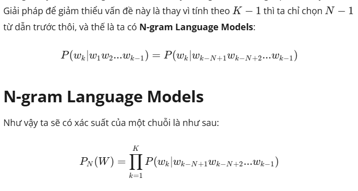

# Statistical LM
- hoạt động dựa trên việc đếm tần suất xuất hiện của 1 từ/chuỗi từ tiếp theo
- kí hiệu P.x (Xác xuất)
- Cách tính xác suất 1 từ trong 1 chuỗi: P.x = 
- Cách tính xác suất của 1 chuỗi có độ dài K P.k: 
- Khi K lớn thì P.k càng gần về 0, dẫn đến chuỗi K k bao giờ xảy ra, nên giải pháp để giảm thiểu vấn đề này là N-gram Language Model

# N-gram language model
- trong công thức tính xác suất của 1 từ trong 1 chuỗi P,x, thay vì dùng K-1, thì ta chỉ dùng N-1,
- 
- thông thường người ta chọn N = 1,2,3
- Model này còn có tên khác là (N-1)-order  Markov Model

## nhược điểm của N-gram LM
- khi thay từ K-1  thành N-1, sự chính xác của kết quả sẽ giảm
- Bão hoà: khi data quá nhiều, thì phân bố xác suất lúc ấy sẽ k thay đổi
- nguồn dữ liệu khác nhau sẽ ảnh hưởng đến mô hình ??
- Thưa thớt dữ liệu: N-gram LM chỉ giảm hiện tượng xác suất = 0, chứ chưa giải quyết được hẳn